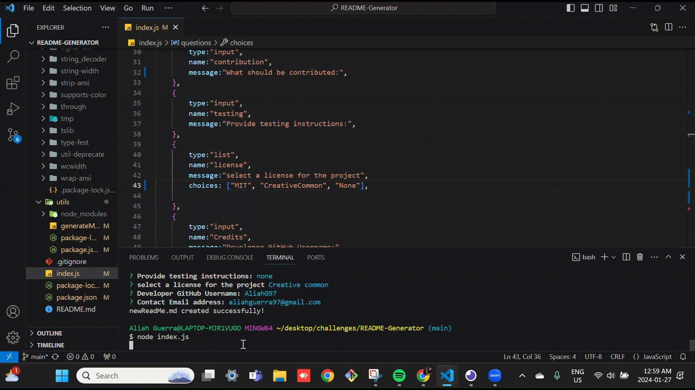

# README-Generator

## Description
The ReadMe Generator app is a command line application designed to streamline the process of creating high quality README.md files for open source projects on Github. It uses the Inquirer package to dynamically generate a professional readme file based on the user input.

## Table of contents
- [Installation](#installation)
- [Screenshot](#screenshot)
- [Features](#features)
- [Usage](#usage)
- [credits](#credits)
- [License](#license)
- [Contributing](#contributing)

## Installation
To install this project git clone https://github.com/AliahG97/README-Generator.git

## Screenshot
 https://aliahg97.github.io/README-Generator/

## Features

1. Prompts: The app prompts questions to the user for information about the project repository, guiding them through the read me creation process.

2. Structure: The application ensures that the MARKDOWN file follows the professional README structure. Sections are organized according to description, table of contents, installation, usage, license, contributing, testing and questions.

3. License Badge: The generator allows the user to choose a license for the application from the list of choices. It adds the corresponding badge shield in pink at the top of the file.

4. Credits: The developer is prompted to input their Github username and email address, as well as a link to the Github profile with user instructions. 

5. Table of Contents: When users click on links in the table contents it will navigate the to the corrresponding section of the README.md file.

## Usage
This app is ideal for any developers who want to save time on generating an automated detailed professional ReadMe.md file for their code.

## Credits
Aliah Guerra (https://github.com/AliahG97)

## License
Creative Commons License
by Aliah Guerra2024. Confidential and Proprietary. All Rights Reserved.

## Contributing
- Add more license options in thde list of choices.

## Testing
1. Cd to project file
2. Npm install
3. Node index.js
4. Answer all questions prompted
5. Click on the newly generated "newReadMe.md" in the explore panel of the project files.
6. Right click on the ReadMe file and "view as preview"

